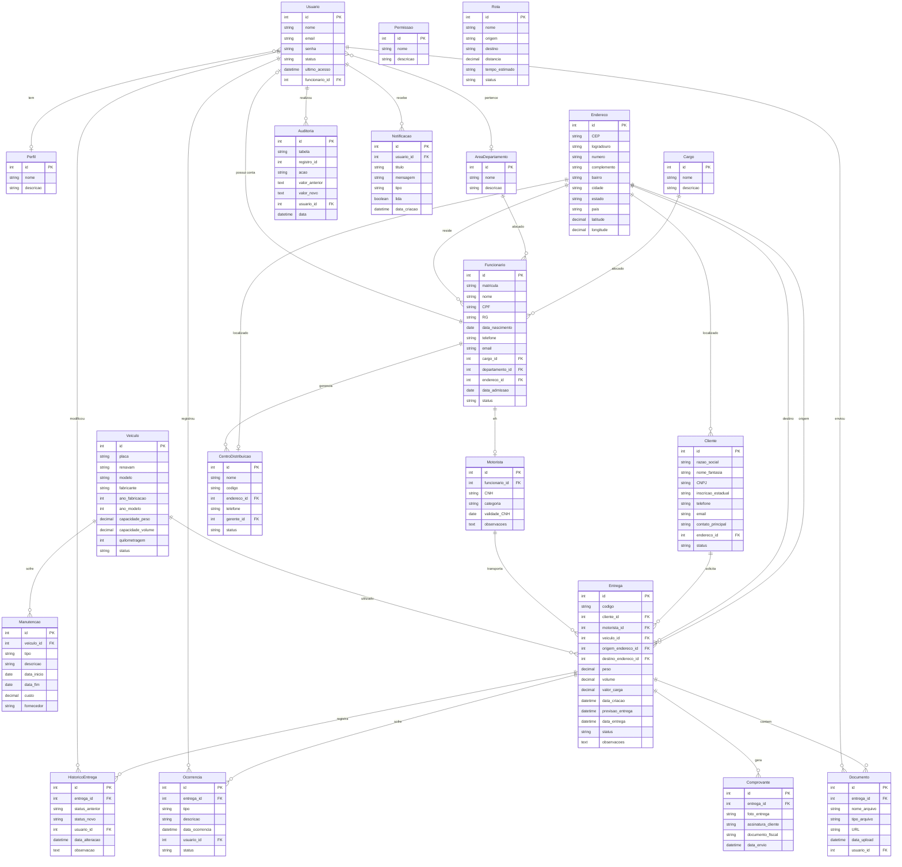

# 🚚 Sistema de Gestão de Operações Logísticas

> Sistema completo para gestão logística de entregas, motoristas, veículos, centros de distribuição e operações.

---

# 📖 Sobre o Projeto

O Sistema de Gestão de Operações Logísticas é um sistema desenvolvido para gerenciar todo o processo logístico de uma empresa, desde o cadastro de clientes e funcionários até o controle completo das entregas.

O objetivo é simular um sistema corporativo real, aplicando boas práticas de arquitetura, desenvolvimento Full Stack, segurança, escalabilidade e organização de código.

Este projeto possui foco em aprendizado de tecnologias modernas utilizadas pelo mercado.

---

# 🎯 Objetivos

- Desenvolver uma aplicação Full Stack moderna.
- Aplicar arquitetura em camadas.
- Utilizar boas práticas de desenvolvimento.
- Trabalhar autenticação e autorização.
- Implementar documentação automática.
- Construir uma API REST robusta.
- Desenvolver uma interface moderna em React.
- Simular um ambiente corporativo real.

---

# 🛠 Stack Tecnológica

## Backend

- Java 21
- Spring Boot
- Spring Security
- Spring Data JPA
- PostgreSQL
- Flyway
- Swagger / OpenAPI
- Maven
- Docker

---

## Frontend

- React
- TypeScript
- Vite
- Tailwind CSS
- Axios
- React Router
- TanStack Query

---

## Infraestrutura

- Docker
- Docker Compose
- PostgreSQL
- pgAdmin (Opcional)

---

# 🗂️ Modelagem do Banco de Dados

O modelo inicial do banco foi criado utilizando DB Diagram.

🔗 [📌 Ver Diagrama do Banco de Dados](https://dbdiagram.io/d/Sistema-de-Gestao-de-Operacoes-Logisticas-6a4fda1136d348d120a910dc)

# 🎨 Protótipo da Interface

A interface inicial do sistema foi desenvolvida como protótipo para validar a experiência do usuário e a organização dos módulos.

🔗 [📌 Ver Protótipo do Sistema](https://zp1v56uxy8rdx5ypatb0ockcb9tr6a-oci3--5173--639e0ff1.local-credentialless.webcontainer-api.io/)

---

# 🏗 Arquitetura

---

# 🧪 Qualidade e Testes

O projeto possui uma suíte de testes automatizados para garantir a qualidade das regras de negócio e dos componentes principais da aplicação.

Tecnologias utilizadas:

- JUnit 5
- Mockito
- Spring Boot Test
- JaCoCo (análise de cobertura de testes)

A cobertura dos testes é acompanhada através de relatórios gerados automaticamente pelo JaCoCo.

## Status dos Testes

| Módulo | Status |
|-|-|
| Department | ✅ 100% Coberto |
| Cargo | 🚧 Em desenvolvimento |
| Employee | 🚧 Em desenvolvimento |
| Address | 🚧 Em desenvolvimento |

📊 Documentação completa dos testes, métricas de cobertura e evidências:

➡️ [Ver documentação de testes automatizados](./backend/docs/README.md)

---

---

# 📈 Evoluções Futuras

- Upload de arquivos para S3
- Integração com Google Maps
- Rastreamento em tempo real
- Mensageria com RabbitMQ
- Cache com Redis
- WebSocket
- Dashboard em tempo real
- Testes Automatizados
- CI/CD
- Kubernetes

---

# 👨‍💻 Autor

Projeto desenvolvido para estudo e evolução profissional utilizando tecnologias modernas do ecossistema Java e React.
